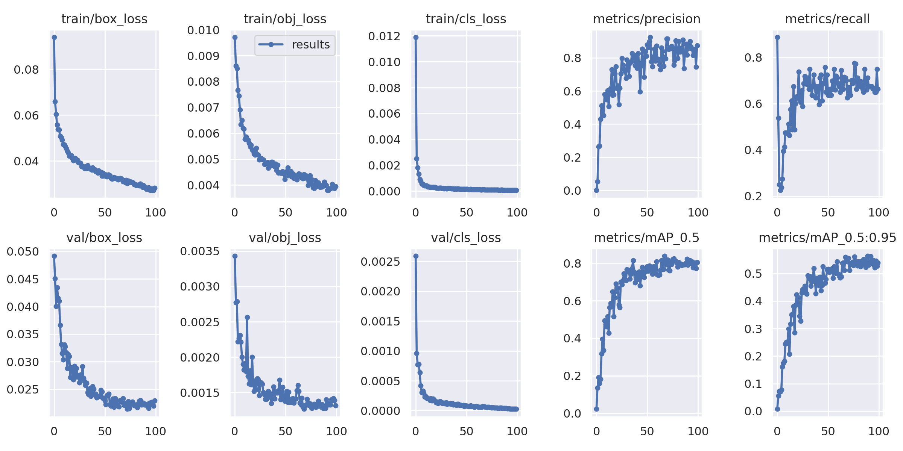
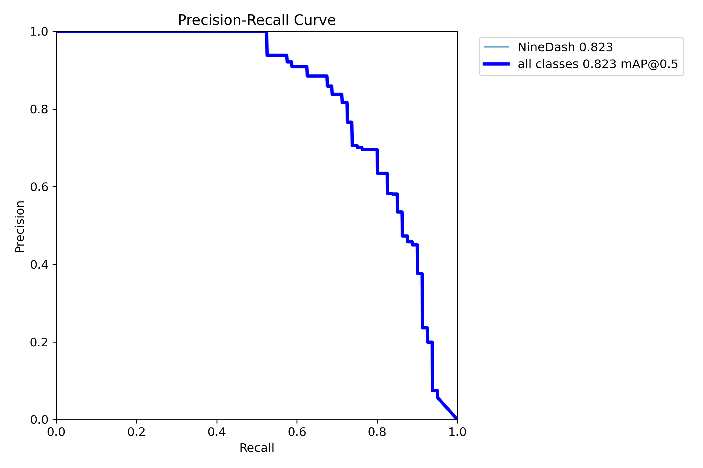
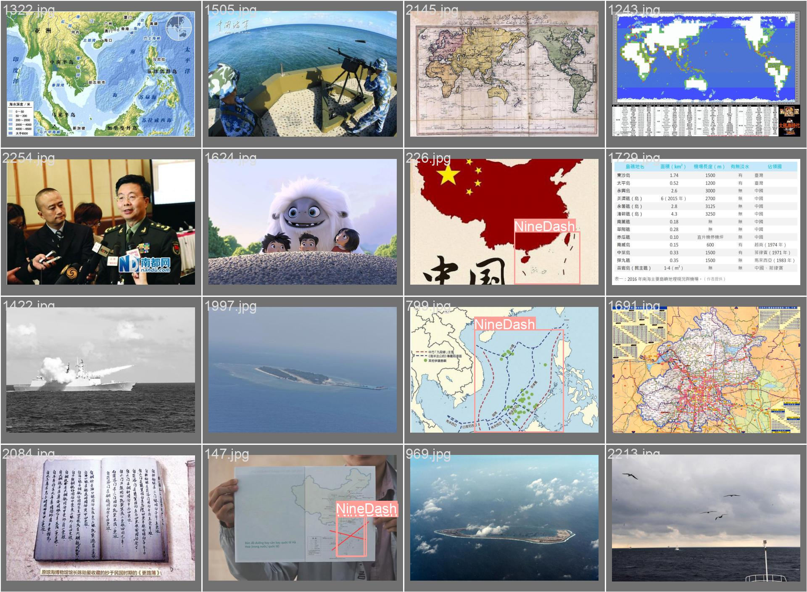

<h1 align="center">Nine Dash Line Detection</h1>

<h2>Preparing Dataset</h2>
<h3>Dataset information:</h3>
<ol>
  <li>Dataset: images folder and annotations json file</li>
  <li>Images folder have 2589 files</li>
  <li>Annotations json file have coordinates of the nine dash line: </li>
  <ul>
    <li>image_id: image name</li>
    <li>width, height: width and height of the image</li>
    <li>bbox: a list of coordinates format [xmin, ymin, width, height]</li>
  </ul>
</ol>

<h2>Configure/modify files and directory structure </h2>

Create a yaml file:

<ul>
  <li>train: ../Nine-dash_Line/images/train/ </li>
  <li>val:  ../Nine-dash_Line/images/val/</li>
  <li>test: ../Nine-dash_Line/images/test/</li>
  <li>nc: 2</li>
  <li>names: ["NoThing","NineDash"]</li>
</ul>

Directory structure will look like this: 

<ul>
  <li>images</li>
  <ul>
    <li>train</li>
    <li>test</li>
    <li>val</li>
  </ul>
  <li>labels</li>
   <ul>
    <li>train</li>
    <li>test</li>
    <li>val</li>
  </ul>
</ul>
<h2>Training </h2>
<ul>
  <li>--img: size of the input image </li>
  <li>--cfg: model selection YAML file. I have chosen “s” </li>
  <li>--hyp: YAML file that describes hyperparameter choices.I have chosen "scratch-high"</li>
  <li>--batch: batch size </li>
  <li>--epochs: number of epochs </li>
  <li>--data: YAML file which was created in Configure files</li>
  <li>--weights: weights file to apply transfer learning</li>
  <li>--workers: Number of CPU workers</li>
  <li>--name: Training weights would be stored in a folder named `runs/train/name`</li>
</ul>

<h2>Result </h2>

